# 四川麻将 AI · 算法全景图解

**代码版本：2.6.82 · abf8c6e · 核对日期：2026-09-28**

> 这是 2.6.82 发布代码的历史图解。后续算法修复及其验证见[2026-09-28 算法修复记录](../algorithm-repair-20260928.md)。本文保留原版本行为与源码证据，供前后对照。

这份图解以当前实际调用的代码为准，覆盖从发牌定缺、每次摸打与碰杠胡，到血战继续、记牌推理、阶段变化、单行道与地狱模式。它描述实现现状，不把类名、日志用语或设计文档直接当成已经实现的能力。

**先回答最关键的问题：普通模式是每家以自己的视角独立决策，但会评估整桌公开局势；地狱模式另加全信息与三家协同。计算服务共用，普通模式的暗牌输入不互通。**

阅读顺序：先看 01–03 建立全貌，再看 04–09 理解怎么打，最后看 10–15 理解特殊模式、运行边界与源码依据。

图中实线表示当前调用或数据流；虚线表示条件分支、诊断能力或有条件的影响。文中的“概率”“净值”除明确说明外均是当前算法的模型估计，不是经过实战校准的真实胜率或保证收益。

## 01 · 谁在计算：独立视角、共享引擎、整桌观察

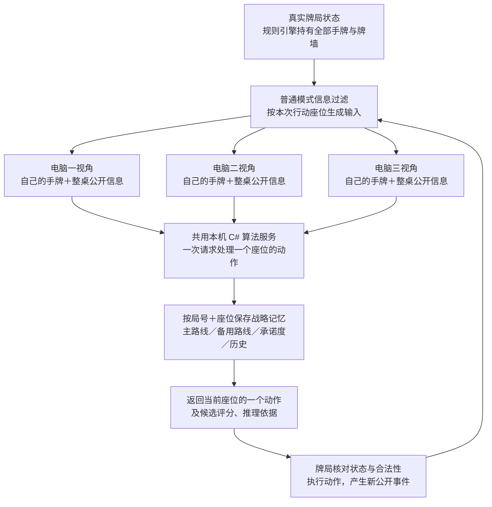

“独立”指的是**输入视角、行动目标和按座位保存的战略记忆**。并不是电脑一、二、三各装了一个不同模型，也不是一定同时开三个线程计算。`SichuanCSharpRuntime` 持有一个 `SichuanAiFacade`，各座位依次或通过后台请求使用同一套引擎。

普通 AI 会分别判断其他三家的威胁、定缺、花色需求和可能听口，考虑还有几家付款、谁已经胡牌退出，因此有整桌局势意识；但它没有把三家普通 AI 的得分合并成团队目标，也没有逐层求解四家所有未来打法。

主战略记忆以 `(round, seat)` 分开存放。底层还有共享的推理缓存、一次决策缓存和“上一份上下文”缓存；不能把实现描述成四套完全隔离的运行实例。缓存本身也不等于允许读取别家的暗牌。

单机在本设备计算；联机由房主侧的权威牌局推进，客户端提交动作并接收投影后的状态。iPhone、iPad 的正常模式调用同一 C# 核心，移动端压缩返回内容，不默认降低策略。没有在线大模型调用参与实时选牌。[S01][S02][S03][S04]

## 02 · AI 能看见什么，不能看见什么

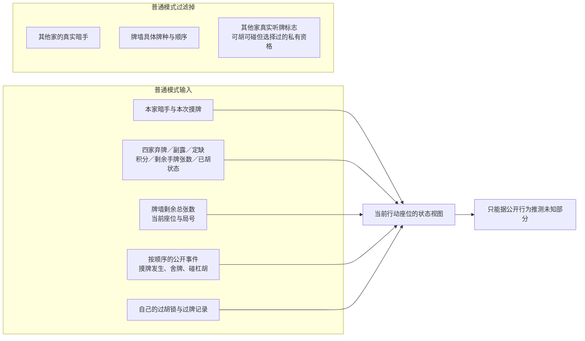

| 信息 | 当前普通输入的处理 |
|---|---|
| 自己的暗手 | 精确 27 种牌计数；变量名 `Hand18` 是历史命名，实际长度 27 |
| 其他人的暗手 | 不传具体牌；传剩余张数 |
| 他家摸牌 | 保留“他摸过牌”这个事件，牌种改为 `-1` |
| 他家听牌 | 不把游戏内部 `is_ting` 当公开事实传入 |
| 碰杠 | 传副露牌种和类型；`IsCalled` 在当前桥接中表示“已有副露”，不是报听 |
| 他家过胡／过碰／过杠 | 私有资格产生的 pass 事件整体过滤，矩阵只保留本家行 |
| 自己过胡后的限制 | 保留自己的锁番、锁定时点与摸牌解锁标志 |
| 牌墙 | 普通模式只传总量，不传真实构成和顺序 |
| 手切／摸切 | 事件存在且来源已记录时可用于推理；未知来源不能当成手切 |

因此，虽然推理库有“某人能碰却没碰”的计算接口，**当前实战桥接没有把其他人的私有可碰资格送给普通 AI**，不能在图里宣称它平时知道谁故意不碰。[S03][S05]

## 03 · 整局动作循环：先合法，再选择，再执行

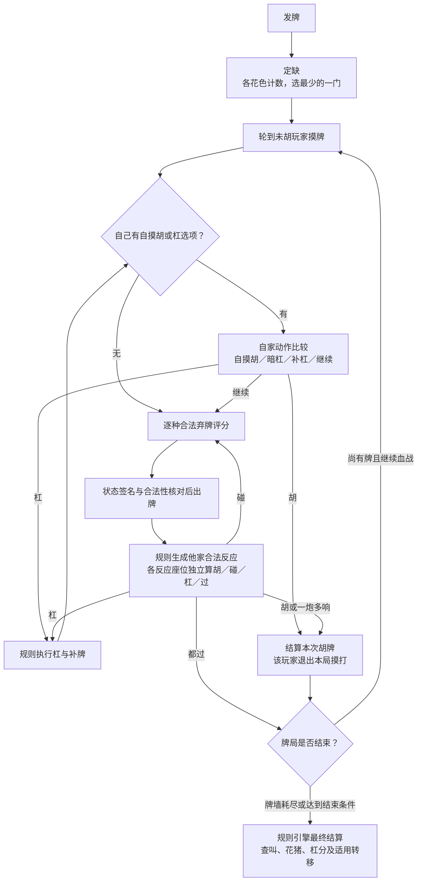

本图的“逐种”指同一种牌只评价一次，不必给四张相同牌重复算四次。最终再映射成手里具体那张牌的 ID。

定缺是当前最简单的一层：只比较三门张数，平手按花色输入顺序选。默认条、筒、万；**没有比较拆搭损失、清一色潜力或定缺后的整手收益**。

有缺门牌时必须先打缺门，合法性优先于任何做大策略。胡、碰、杠资格由规则层产生；AI 只从这些动作中选择。执行时重新核对局号、座位、阶段、牌墙、手牌及公开状态签名，旧状态上的结果不能直接落地。C# 未返回有效结果时会保留错误状态，不用前端简化打牌冒充成功。[S06][S07]

## 04 · 记牌与推理：从确定数量到不确定分布

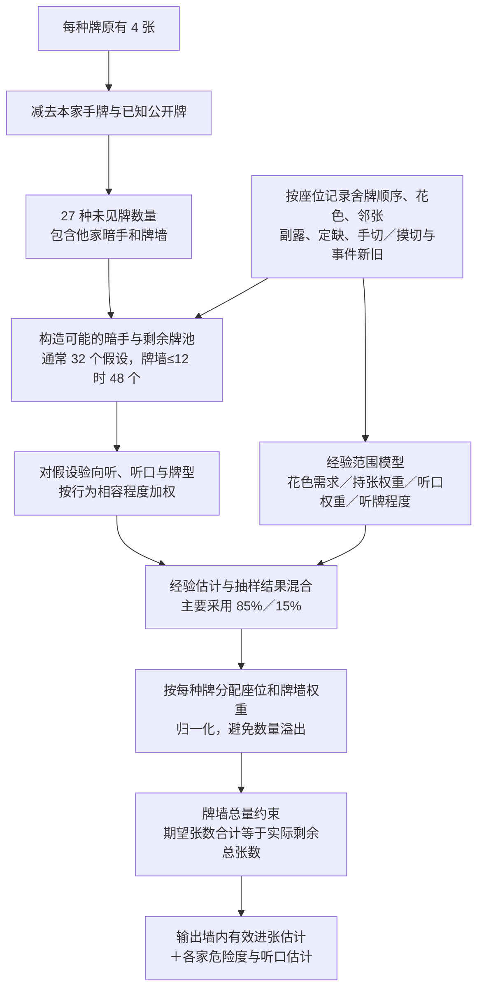

记牌分成三层：

1. **数量账**：自己的每种牌、牌河、副露、已公开的胡牌张、未见张数、牌墙总量。
2. **时序账**：谁先切什么、最近切什么、手切还是摸切、碰杠改变了哪些公开结构、是否已经退出。
3. **推理账**：未知牌可能分布在哪家或牌墙，各家可能需要哪门、是否接近听牌、哪些牌更危险。

桥接中 `Visible18` 实际已包含本家手牌；`Remaining18 = max(0, 4 − Visible18)`。所以这里的“可见”应理解为**对本 AI 已知**，不能不加区别地再减一次本家手牌。

举例：自己有 1 张五筒，外面已见 2 张，则未见最多 1 张。但它可能在其他人的暗手里；AI 还要估计其中有多少属于牌墙。墙内期望可以是 0.35 张，这表示不确定分配的平均数。供部分整数算法使用时，会再转换为总量一致的代表性整数牌墙。

推理细节：

- 经验模型考虑中张联络性、邻张可见量、同门舍牌数、副露集中度、舍牌进度与牌墙压力。
- 抽样从未见牌池分配假设暗手；不是读取真实暗手。每种牌抽到后从池中减掉，避免同一张牌同时分给两家。
- 普通当前分支使用 `BehaviorWeightedLegacy` 提案：行为倾向同时影响抽牌权重和假设权重；新“公开先验＋一次似然”提案主要用于诊断分支。两者不能混称为同一套严格贝叶斯后验。
- 持张、听口、听牌程度先按 85% 经验＋15% 抽样混合；持张项随后还会经过归一化覆盖。牌墙份额也混合归一化份额与抽样份额。
- 普通粒子默认不完整纳入已退出玩家的暗手；后续牌墙总量层能约束总数，但不能因此宣称所有隐藏分配都精确。长程诊断另有包含退出玩家的守恒投影。
- `hold probability` 经归一化后还承担“该牌分配给某座位的份额”含义，并不处处等价于“至少持有一张的真实概率”。[S08][S09][S10][S11]

## 05 · 如何推断危险：硬规则、软证据、临时安全

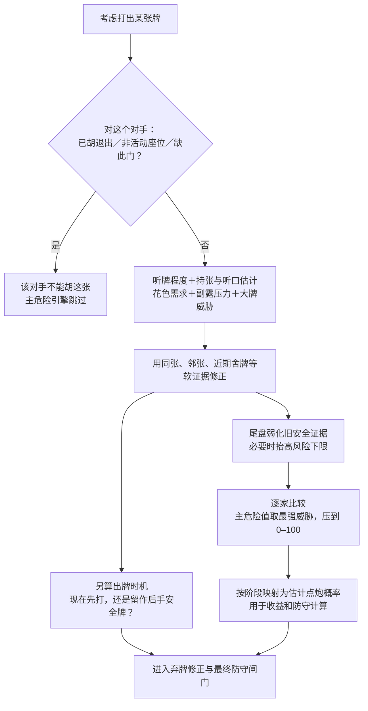

| 证据 | 当前实现怎样解释 | 不能推成什么 |
|---|---|---|
| 对手定缺某门 | 不能胡该门；但未清完缺时仍可能持有 | 不能说开局手里就没有该门 |
| 对手打过同张 | 降低“还需要这张”的估计；越近权重通常越大 | 四川没有永久自弃振听，不能认定永远安全 |
| 近邻牌舍出多 | 作为局部搭子需求减弱的软证据 | 不能直接复原整副暗手 |
| 同门连切多 | 降低该门需求，形成弃门倾向 | 除明确的定缺合法性外，不是零概率 |
| 副露集中一门 | 提高该门需求与清色／大牌威胁 | 一次碰牌不等于已经听牌 |
| 最近同张通过 | 有限时间的安全储备，随事件距离衰减 | 不是永久安全证书 |
| 补杠风险 | 用公开听口／听牌估计 | 不读取“真实有几家能抢杠” |

当前主危险分级为：低危 `<34`、中危 `34–55`、高危 `56–77`、极危险 `≥78`。危险值主要取各家风险的最大值，不是把三家点炮概率严格相加；上下文中另有分级阈值，不能把不同模块的数字直接混用。

一个值得知道的实现偏向：范围模型只要看到 `IsCalled=true`，就先给出 `0.86` 的听牌程度经验值，再与粒子混合；而桥接的 `IsCalled` 只是“已有副露”。因此当前 AI 可能较早把副露玩家视为强威胁。这里是启发式赋值，不是“听牌概率已被测得为 86%”。

时机模型会同时考虑：危险牌以后是否更难打出去、清色威胁拿到它的收益、近期安全牌是否值得保留。它对最终分数的贡献被限制在小范围内。`SeatExactSafeTiles` 字段虽保留，但当前证据构造器没有把“自己打过的牌”灌成永久安全集合。[S12][S13][S14]

## 06 · 每张弃牌到底怎么算

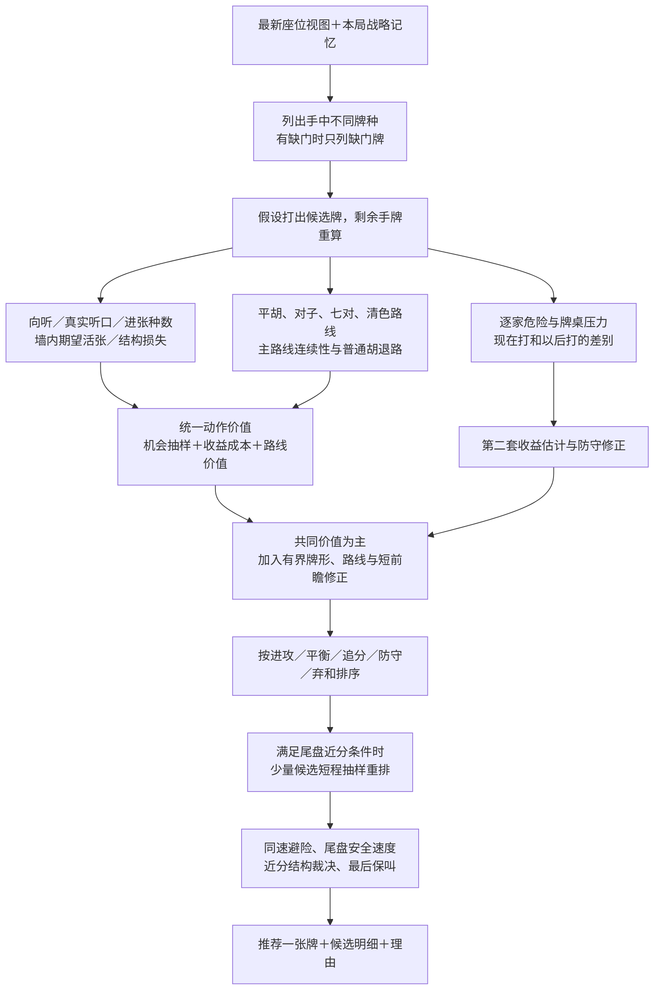

**手牌结构层。** 普通向听递归枚举刻子、顺子、对子与搭子的互斥分解；门清时再比较七对向听，四张同牌可按两对计算。向听 `−1` 表示已成胡形，`0` 表示听牌，`1` 表示一向听。每次假设弃牌后，枚举可能进张，检查是否降低向听；听牌则逐种补牌并验证真实胡牌分解。

**质量层。** 比较两面、嵌张、边张、单钓、双碰；评估中张联络、对子压力、搭子过剩、同向听改良、拆对拆刻、连续顺形、孤立幺九。它不只是数“进张种类”，还比较未见量和墙内估计。经典牌形分数 `ClassicPatternScore` 目前写入候选诊断，并未直接加到这条主评分公式中。

**统一价值层。** 普通主路径对每个候选调用机会节点抽样，当前传入 512 次。它用活张总量、牌墙总数、活动人数、简化赢分和对手赢牌参数模拟机会；没有在每次抽样里完整重建四家打牌策略。尤其非听牌时，改良张被作为推进／成功代理量使用，不能把输出直接当真实胡牌概率。

它合并自己收益、杠收益、查叫价值、路线／退出价值，减去点炮、对手后续收益、结构损失及不确定性成本。多人效用是当前行动者的视角；普通 AI 不因此变成共同围攻玩家的团队。

**实际组合公式。** 代码当前先算：

```text
V = U + 0.06 × L + 0.05 × R + 0.20 × M − 0.35 × D
Score = round(100 × V)

U：统一动作价值
L：有限前瞻分，限制在 −18 至 24
R：分别限幅后合计的牌形、路线连续性和出牌时机证据
M：第二套预计净值与 U 的差，限制在 −2 至 2
D：后验防守成本，限制在 0 至 2
```

`R` 中普通牌形最多 ±0.75，保对保刻 ±2.50，连顺与听牌中张各 ±1.25，尾盘对子听口 ±1.50，路线连续性 ±2.00，出牌时机 ±0.85；孤立幺九的限幅随阶段变化。它们合计后再乘 0.05。这样可限制旧经验分压过共同价值。

但**最终动作并不总是 Score 最大者**：防守／弃和模式先分安全层级，后面还有显式闸门能换掉首选。阅读候选表时必须连同“实际推荐”及覆盖理由一起看。[S15][S16][S17][S18]

## 07 · 大牌路线如何保持，又何时放弃

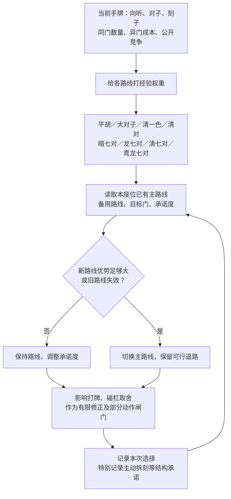

路线不是每摸一张就从头忘记重选。持续大脑记住主／备用路线、目标花色、承诺度和近期动作。切换基准优势门槛是 `8 + 承诺度/5 + 阶段×3`；很早期的前两次观察、已较成形的清色路线还会提高切换门槛。

七对系列要求门清；五对以上显著提高承诺，碰杠会损失门清与四张当两对的结构，因此反应层设有较重保护。主动拆刻会留下记录，防止下一步轻易把刚拆掉的刻子又碰回来。

清一色还会调用专项规划：假设当前弃牌，再枚举摸牌与随后弃牌，比较成叫、听口、目标门竞争、根杠潜力、危险与普通胡退路。当前这个较老的专项仍以 `Remaining18` 未见牌量做部分估计，**并非所有子模块都已经统一到墙内期望口径**；所以它只作为有界路线证据，不能把显示的完成率当实战标定概率。

番型识别与路线规划也不同：评分投影能识别金钩钓、将对、十八罗汉等，不意味着持续大脑为每一种番型都有一套独立长程规划器。预测基础规则使用冻结快照：27 种牌、每种 4 张、无吃、血战、一炮多响、四番封顶、自摸加底；最终是否合法与如何结算仍由实际游戏规则执行。[S19][S20][S21]

## 08 · 前、中、后期：实际阈值与策略模式

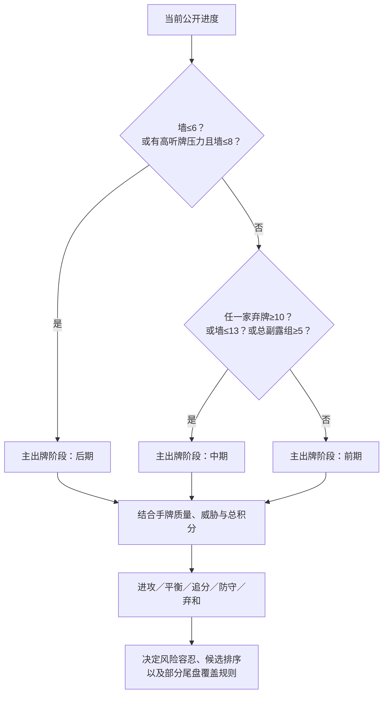

这里“高听牌压力”在主出牌阶段器中包括：他家已有副露、真实输入允许的听牌标志，或推理听牌程度 `≥0.55`。普通桥接不会提供他家真实听牌标志。代码还有“有压力且墙≤10 划中期”分支，但已被墙≤13 的判断覆盖。

| 层次 | 前期 | 中期 | 后期 |
|---|---|---|---|
| 主出牌阶段器 | 不满足后两列时 | 最大弃牌数≥10，或墙≤13，或总副露≥5 | 墙≤6；或有上述压力且墙≤8 |
| 持续战略记忆 | 不满足后两列时 | 最大弃牌数≥9，或墙≤13，或总副露≥5 | 墙≤6，或最大弃牌数≥15 |
| 碰杠／自家动作阶段器 | 不满足后两列时 | 最大弃牌数≥10，或墙≤13，或总副露≥5 | 墙≤6；或存在副露／听牌标志且墙≤8 |
| 路线粗价值模块 | 墙>16 | 8<墙≤16 | 墙≤8 |

**没有统一的“第几巡以后全部切换”开关。** 同一局面可能被主出牌视作中期、持续记忆视作后期，这是当前多模块实现的实际状态。

前期主要保留可扩展结构、建立主路线、清理缺门与低价值孤张；中期在成叫速度、墙内活张、大牌机会和他家压力之间取舍；后期增加点炮风险、查叫与保叫权重，重评旧安全证据，不轻易用死叫换掉有改良的手牌。这些是组合效果，不是三套完全分离的算法。

阶段之外还有总积分：领先且临近结束倾向保护领先；落后至少 12 分被识别为落后，最后两局或落后至少 24 分进一步触发追分倾向。威胁极高时仍可进入防守或弃和，并非落后就无条件冲。

最后几张的闸门尤其具体：墙≤5 时可启用硬防守与最终保叫；墙在 1–8 且存在相近风险的更快路线时可改选；最终保叫会找危险<70 的听牌候选。闸门按代码顺序依次执行，后面的判断可能覆盖前面的选择。[S22][S23][S24]

## 09 · 碰、杠、胡、过：比较的是动作之后的局面

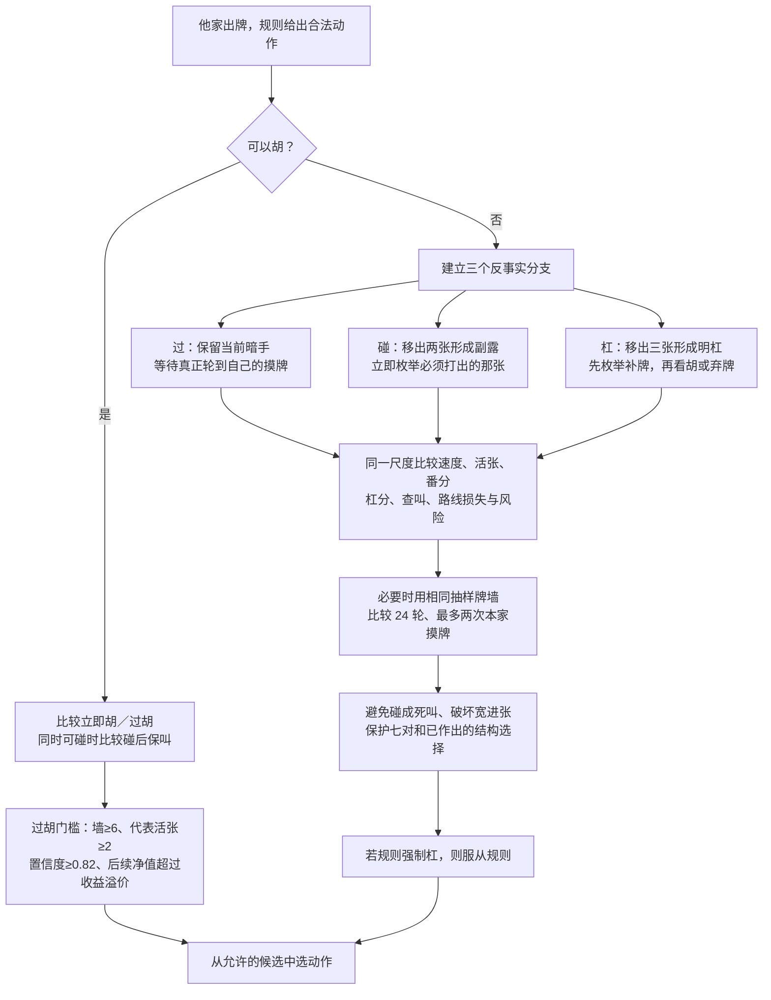

这层真正重要的是**时序不同**：过不会凭空先打一张；碰后要马上打牌，可能被迫打危险张；杠后先补牌，可能直接胡，也可能补完还要冒险打牌。每条分支都有不同的下一次本家摸牌位置。

普通碰杠评分会先生成旧经验诊断，再由统一反事实值重排；在这一反应主路径里，旧经验分明确只留作诊断，不直接参与最后统一分。七对路线损失、主动拆刻后的回碰损失及反应闸门仍能影响选择。

胡牌并非一个无条件按钮：

- **自摸可胡：当前直接胡。** 代码会计算确认信息，但最终返回胡。
- **普通接炮可胡：可以比较过胡。** 未来收益扣除顺胡锁成本、风险和不确定性后，需要至少高于即时收益 `max(0.25, 即时收益×25%)`，还要满足活张、牌墙和置信度门槛。
- **同时能碰能胡：** 可以评估碰后仍听的分支；用实际出牌引擎预测碰后的首打，只为这条真正可能执行的后续路线估值，再扣强制首打风险。不随便假定碰后会打出理想牌。
- **自家暗杠／补杠：** 与继续出牌比较，计算补牌、杠收益、七对损失及补杠被抢风险。实际可抢杠人数不进入公平判断。
- **地狱模式接炮可胡：直接胡**，与普通过胡路径不同。[S25][S26][S27]

## 10 · 前瞻有几层，各算多远

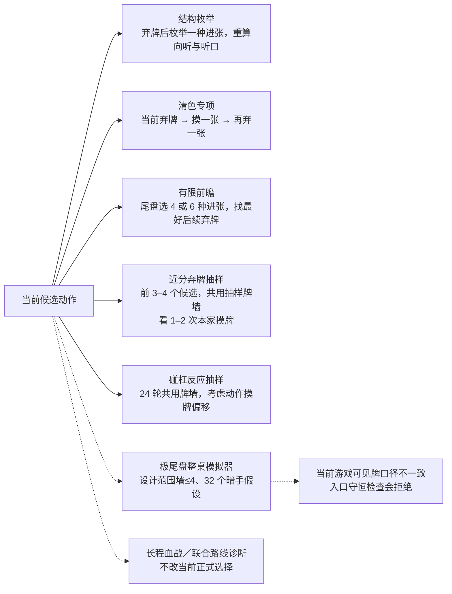

| 层 | 实际范围 | 对动作的影响 |
|---|---|---|
| 向听／听口枚举 | 遍历合法弃牌与可能进张 | 核心输入 |
| 统一机会抽样 | 弃牌 512 次；副露反事实 256 次；抽象成功／失败事件 | 统一价值主项；不是四家完整对弈 |
| 清色专项 | 满足路线或粗完成估计条件时，枚举下一摸与再弃牌 | 有界路线修正 |
| 有限前瞻 | 墙≤6 取 6 种；墙≤12 且向听≤1 取 4 种；其余不启用这一层 | 加权后限幅 |
| 名为 MCTS 的弃牌搜索 | 墙 1–12；前两候选统一价值差≤0.70 或总估值差≤0.55，再经过内部条件 | 45ms；墙≤8 为65ms。前3，墙≤8前4；墙≤10看2摸，否则1摸 |
| 碰杠短搜索 | 多个候选接近，或较早期碰杠领先等条件 | 24 轮、每条路线最多2次本家摸牌 |
| 极尾盘整桌模拟 | 模块设计为墙≤4、保听候选、32粒子、同组牌墙比较 | **当前实战桥接口径下被阻断** |
| 更长血战／公开联合路线 | 显式诊断接口，或测试策略开关 | 当前 `current` 策略不采用 |

弃牌抽样没有树节点 UCT 选择、完整四人动作扩展或对手最优策略求解；它在同一抽样墙上比较少数候选的本家短程推进。搜索修正限制在 ±0.75 后加回，因此不能等同于“全局最优证明”。不同设备在限时内完成的样本数量可能不同，同一策略并不保证所有近分局面在每台设备上逐位一致。

**入口问题的验证。** 小型验证调用当前编译核心的 `TryPrepare`：同一合法手牌与未见牌池，用不含本家手牌的公开可见数组时通过并得到 1 个候选；用当前游戏桥接的“可见已含本家手牌”数组时拒绝，5 种持有牌违反它要求的 `Hand + Visible + Remaining = 4`。该游戏桥接满足的是 `Visible + Remaining = 4`。因此不能把这个整桌尾盘模拟器标成当前游戏已经有效发挥作用。已退出玩家未纳入分配、过胡锁等情况还会另触发它的拒绝条件。

本次只是记录和验证这一现状，没有修改算法。[S28][S29][S30]

## 11 · 单行道：怎样保留这一门，又怎样留出退路

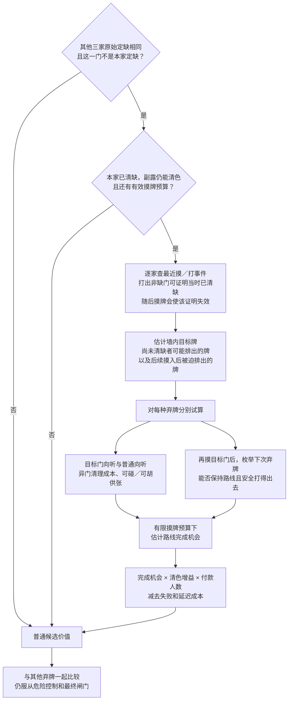

它不是简单的“这门一律不打”。新模块逐候选比较保留目标门与打出目标门的代价，并将分值加入统一动作价值。

关键实现：

- 激活依据是**其他三个座位的定缺都相同**，不是只看当前剩下的一两个对手碰巧同缺；计算付款人数和供张时再只看仍在场玩家。
- 本家缺门未清、已经有异门副露导致清一色不可能、没有剩余摸牌预算时，专项不加值。
- 本家摸牌预算为 `min(18, floor(牌墙数/活动人数))`，是简化预算，不逐一模拟所有将来的抢碰、杠和退出。
- 供张只有已有对子／刻子能碰杠，或可直接胡时才计入有效完成帮助；没有吃牌。
- 针对目标门的下一次进张，再逐种试弃：墙>24 时可容忍普通路线暂时多一向听；墙≤24 时不允许这一额外退步。
- 后续可弃牌数量会按当前危险度折减，保留多条可走出口比只剩一张危险牌可打更有利。
- 完成机会由固定推进率的二项尾概率近似，再乘未来弃牌空间系数；清色基础 2 番，根与封顶限制后估算增益，扣除做大失败／拖慢成本。

这些是有边界的近似。未来出牌风险用当前公开估计，不能预知那时对手的新听口；供张按手牌数量与预算分配，也不是逐张精确反推。全部活动对手都显示已清缺时，模块会把该门未见牌视作在墙内，这还依赖未见池没有夹带退出玩家暗手的前提；当前实现未在此处做完整退出暗手分离。图中所以使用“估计收益”，不写“已经实现全局收益最大化”。[S31]

## 12 · 地狱模式：共享暗牌与协同到底到了哪一步

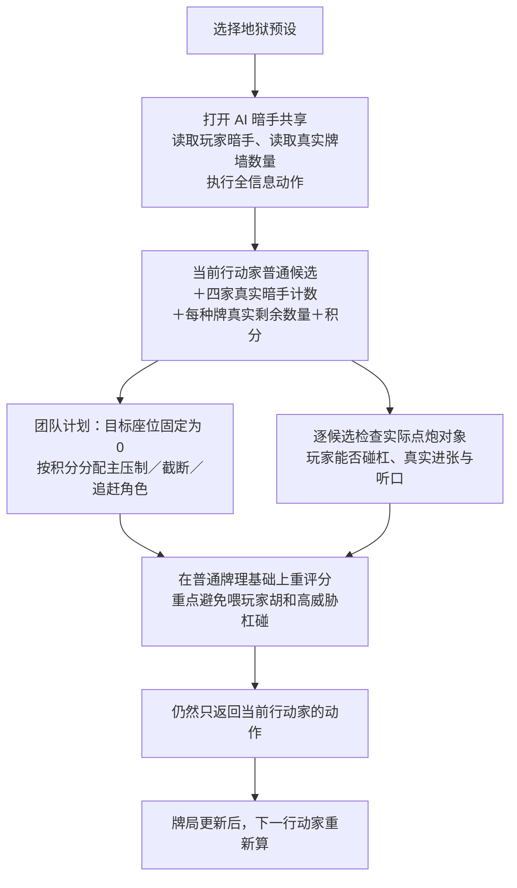

地狱预设默认会打开三项信息权限：AI 暗手共享、看玩家暗手、看牌墙。实际挑战入口还要求预设为 `hell`、执行全信息动作开关和看墙开关成立。

它传的是**牌墙每种牌的剩余张数，不是牌墙顺序**。因此能够知道还有几张某牌，却没有从这个输入直接知道“下一张必定摸到什么”。

出牌先获得普通骨灰引擎的合法候选与牌理，再利用真实手牌检查具体点炮风险、是否让玩家碰／杠、真实活张等。角色按积分选择主压制者，对当前行动者和落后 AI 设置截断／追赶倾向。各家仍逐次出动作，并没有联合枚举三家完整策略或优化全部后续团队总分。

这也不是“永不放任何碰”：代码保留普通碰的互动空间，自己能保持速度、对方碰后威胁不高时可以放行。能胡时则直接锁定收益。自摸、暗杠／补杠的前置动作仍走共用自家动作入口，不能把所有环节一概说成全透视专用求解器。

因此回答“是不是全盘计算”必须分三种意思：

| 问题 | 普通模式 | 地狱挑战 |
|---|---|---|
| 是否看整桌公开局势？ | 是 | 是 |
| 是否拿到其他家真实暗手与墙内数量？ | 否 | 开关打开时是，地狱预设默认打开 |
| 是否三家使用协同压制目标？ | 没有这层团队计划 | 有，固定针对座位0 |
| 是否精确知道牌墙下一张？ | 否 | 此输入也没有牌墙顺序 |
| 是否求解四家全部未来最优打法？ | 否 | 否 |

联机或非默认座位布局下，固定目标0也不自动等于“所有真人”；这是当前团队规划器的假设。[S32][S33][S34]

## 13 · 已胡退出、流局收益与实际规则的边界

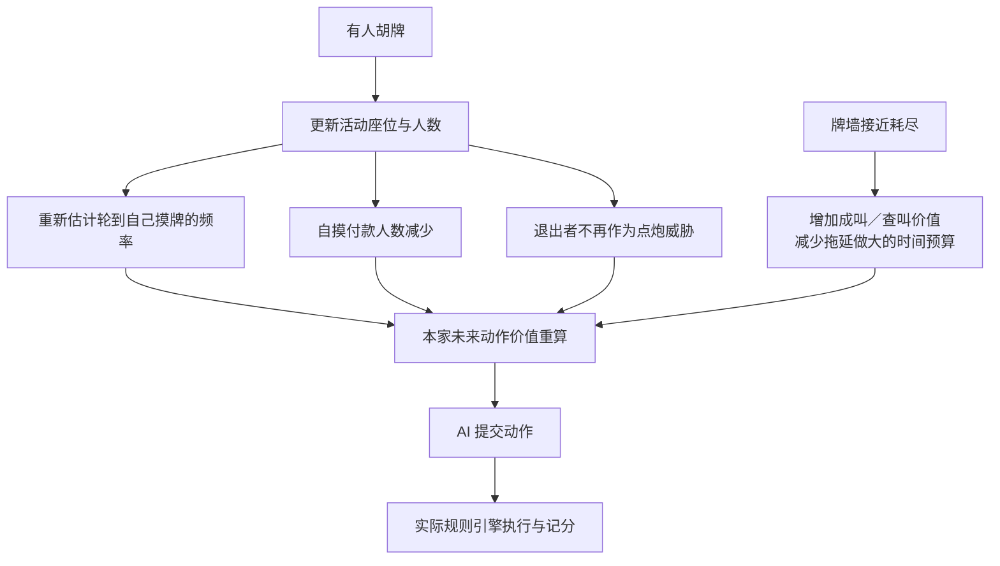

AI 的收益估计考虑点炮单家付款、自摸多家付款、番型与根、杠分、血战人数变化、查叫风险。规则投影支持杠后、抢杠、呼叫转移等计算；冻结预测快照的退杠开关当前为 `false`，因此不能因代码里存在退杠相关类就写成“所有决策都启用退杠”。

不同估值层精度不同：完整手形的番型投影可以按分解算分；普通弃牌机会模型仍使用一些固定赢分／对手损失系数；第二套期望分又用估计番型、胡牌份额和查叫压力。**“统一动作净值”是一种比较尺度，不能理解成所有候选都经过同一套完整规则对弈算出的精确现金期望。**

AI 不决定庄家规则。实际牌局在下一局按第一批胡牌事件确定：首个单独胡牌者坐庄；首次就是同一张牌的一炮多响则放炮者坐庄，后续多响不覆盖先胡者。[S18][S21][S35]

## 14 · 缓存、运行与学习：哪些在持续，哪些没有启用

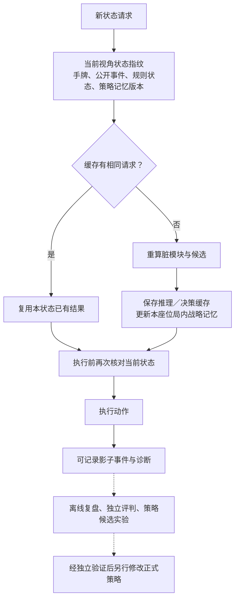

| 类型 | 当前状态 |
|---|---|
| 局内连续记忆 | 启用，保存路线承诺、近期选择和拆刻记录 |
| 推理与决策缓存 | 启用，节省相同状态重复计算；推理缓存上限256份 |
| 后台计算 | 提供原生后台请求、轮询和同步入口；后台并不意味着脱离最新状态自主打牌 |
| iOS NativeAOT | 使用同一 C# 核心的编译产物和紧凑传输入口 |
| 移动轻量模式 | 需要显式标志；正常桥接 `mobileSpeedMode=false` |
| 自动学习持久化 | `AI_LEARNING_RECORDING_ENABLED=false`，新局也据此关闭自动学习 |
| 影子记录 | `AI_SHADOW_RECORDING_ENABLED=true`；记录不等于自动改策略 |
| 视频知识／离线训练／联赛评测类 | 有工具与代码，不能据此宣称在手机上边打边训练 |
| 测试策略变体 | 需指定 `policyVariant`；正常为 `current`，联合路线 shadow 与 v1/v3–v7 不默认生效 |
| 筋线断张／孤张活性等汇总指标 | `PublicReadFeatures` 中会生成；当前核心未发现读取这些汇总键来改变候选的调用。底层舍牌、邻张、手切证据仍有其他实际消费路径 |
| 主动战略性点小炮接口 | `CanStrategicallyDealIn` 存在，但当前未发现正式调用；不能说普通 AI 已启用“故意喂小胡压大胡”的完整策略 |
| 中级与骨灰预设 | 配置参数不同，但当前这条 C# 桥接没有把多数旧倾向参数传给核心，实际又直接执行推荐牌；不能仅凭预设参数表宣称它们使用两套已验证的不同强度策略 |

“越打越记得本局路线”与“跨局自动训练越来越强”是两回事。当前明确生效的是前者。中级／骨灰分流效果、共享上下文缓存键的隔离程度需要专门行为验证，本文不把未做的验证写成结论。[S01][S04][S07][S36][S37]

## 15 · 完整模块地图、现状与证据

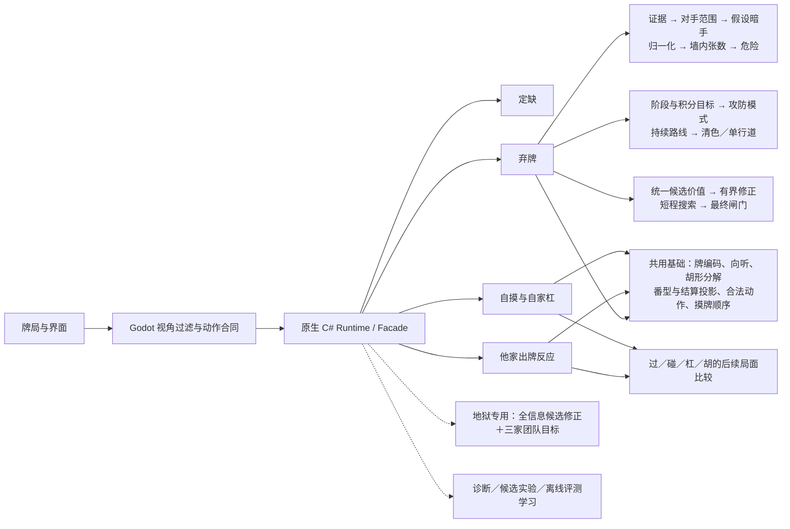

**当前能力应这样概括：** 规则与精确牌形计算为基础，公开行为推理与少量隐藏牌假设提供不确定信息，路线记忆保持连续性，候选动作通过近似收益、防守约束和有限前瞻选出；地狱模式再叠加真实隐藏信息与团队压力。

当前正式入口并不是神经网络或大语言模型下棋：主要组成是程序规则、人工设计的启发式、递归枚举和随机抽样估值。

**需要保留的现实边界：** 普通推理不是精确读心；分值与概率没有统一完成实战校准；前中后期阈值不统一；部分清色与上下文模块仍使用未见牌代理；极尾盘模拟受可见牌口径阻断；长程联合搜索和自动学习不能列为默认能力。这里未改动任何游戏算法，也未运行与说明任务无关的固定回归。

### 术语速查

| 术语 | 在本图解里的意思 |
|---|---|
| 向听 | 到听牌还差多少步的结构指标；0为听牌，−1为成胡形 |
| 进张／有效牌 | 摸入后改善当前向听或听口的牌 |
| 未见张 | 本视角尚未知道位置的牌，可能在对手手里，也可能在墙里 |
| 墙内期望活张 | 估计有效牌中有多少张实际属于牌墙，可为小数 |
| 后验 | 结合已观察行为后更新的估计；当前多处是经验混合估计 |
| 粒子 | 一份可能的暗手与剩余牌池假设，不是真实暗手 |
| 反事实 | 假设现在碰／杠／过／打某张，再比较后续会变成什么局面 |
| EV／净值 | 预测收益减成本的比较分；精度取决于所用子模型 |
| 路线 | 当前倾向完成的牌型方向，如平胡、七对、清一色 |
| 承诺度 | 保持已选路线的惯性；较高时不为很小的短期优势改方向 |
| 退出空间 | 后续还能安全打哪些牌、能否保留普通听胡退路 |
| 闸门／覆盖规则 | 在候选算分后，按明确条件否决或替换原推荐 |
| 影子计算 | 算出来用于观察比较，但不让结果控制正式动作 |

### 源码索引

链接固定到本次核对提交，避免后续改动使说明与代码错位。行号定位入口，阅读时可向后展开对应函数。

| 编号 | 核对位置 | 支撑内容 |
|---|---|---|
| S01 | [Runtime](https://github.com/donachen01/sichuan-mahjong/blob/abf8c6ea1712c7ce08712ef8780b0c91a612d2d0/scripts/ai/SichuanCSharpRuntime.cs#L16)、[Facade](https://github.com/donachen01/sichuan-mahjong/blob/abf8c6ea1712c7ce08712ef8780b0c91a612d2d0/dotnet/AI.Core/Entry/SichuanAiFacade.cs#L8) | 共享服务、正式与诊断入口 |
| S02 | [RoundBrain](https://github.com/donachen01/sichuan-mahjong/blob/abf8c6ea1712c7ce08712ef8780b0c91a612d2d0/dotnet/AI.Core/Engines/SichuanRoundBrainEngine.cs#L6) | 按局与座位保存记忆 |
| S03 | [普通输入桥接](https://github.com/donachen01/sichuan-mahjong/blob/abf8c6ea1712c7ce08712ef8780b0c91a612d2d0/scripts/ai/csharp_ai_bridge.gd#L207) | 输入视角、移动端策略一致 |
| S04 | [联机权威状态](https://github.com/donachen01/sichuan-mahjong/blob/abf8c6ea1712c7ce08712ef8780b0c91a612d2d0/scripts/network/lan_room_session.gd#L111)、[上下文缓存](https://github.com/donachen01/sichuan-mahjong/blob/abf8c6ea1712c7ce08712ef8780b0c91a612d2d0/dotnet/AI.Core/Cache/SichuanAiContextCache.cs#L8) | 房主处理与共享缓存 |
| S05 | [事件过滤](https://github.com/donachen01/sichuan-mahjong/blob/abf8c6ea1712c7ce08712ef8780b0c91a612d2d0/scripts/ai/csharp_ai_bridge.gd#L359) | 他家摸牌、私有pass过滤 |
| S06 | [定缺](https://github.com/donachen01/sichuan-mahjong/blob/abf8c6ea1712c7ce08712ef8780b0c91a612d2d0/dotnet/AI.Core/Engines/SichuanDingQueDecisionEngine.cs#L5) | 最少张数规则 |
| S07 | [实际行动链](https://github.com/donachen01/sichuan-mahjong/blob/abf8c6ea1712c7ce08712ef8780b0c91a612d2d0/autoload/GameState.gd#L1104)、[AI管理器](https://github.com/donachen01/sichuan-mahjong/blob/abf8c6ea1712c7ce08712ef8780b0c91a612d2d0/scripts/ai/AIManager.gd#L1542) | 自家动作优先、执行推荐、失败行为 |
| S08 | [牌计数](https://github.com/donachen01/sichuan-mahjong/blob/abf8c6ea1712c7ce08712ef8780b0c91a612d2d0/scripts/ai/sichuan_tile_codec.gd#L62) | 可见与未见牌口径 |
| S09 | [推理合成](https://github.com/donachen01/sichuan-mahjong/blob/abf8c6ea1712c7ce08712ef8780b0c91a612d2d0/dotnet/AI.Core/Engines/SichuanBeliefEngine.cs#L90) | 32/48粒子、混合、归一化 |
| S10 | [暗手假设](https://github.com/donachen01/sichuan-mahjong/blob/abf8c6ea1712c7ce08712ef8780b0c91a612d2d0/dotnet/AI.Core/Inference/SichuanHiddenHandInferenceEngine.cs#L8) | 默认与新提案区别 |
| S11 | [墙内分配](https://github.com/donachen01/sichuan-mahjong/blob/abf8c6ea1712c7ce08712ef8780b0c91a612d2d0/dotnet/AI.Core/Engines/SichuanWallAvailabilityEngine.cs#L21)、[归一化](https://github.com/donachen01/sichuan-mahjong/blob/abf8c6ea1712c7ce08712ef8780b0c91a612d2d0/dotnet/AI.Core/Engines/SichuanPosteriorNormalizer.cs#L5) | 数量约束与份额含义 |
| S12 | [证据构造](https://github.com/donachen01/sichuan-mahjong/blob/abf8c6ea1712c7ce08712ef8780b0c91a612d2d0/dotnet/AI.Core/Engines/SichuanEvidenceEngine.cs#L5)、[对手范围](https://github.com/donachen01/sichuan-mahjong/blob/abf8c6ea1712c7ce08712ef8780b0c91a612d2d0/dotnet/AI.Core/Engines/SichuanOpponentRangeEngine.cs#L5) | 舍牌软证据与副露压力 |
| S13 | [危险引擎](https://github.com/donachen01/sichuan-mahjong/blob/abf8c6ea1712c7ce08712ef8780b0c91a612d2d0/dotnet/AI.Core/Engines/SichuanDangerEngine.cs#L5)、[风险映射](https://github.com/donachen01/sichuan-mahjong/blob/abf8c6ea1712c7ce08712ef8780b0c91a612d2d0/dotnet/AI.Core/Engines/SichuanRiskCalibration.cs#L3) | 硬排除、风险分级和点炮代理 |
| S14 | [出牌时机](https://github.com/donachen01/sichuan-mahjong/blob/abf8c6ea1712c7ce08712ef8780b0c91a612d2d0/dotnet/AI.Core/Strategy/SichuanDefenseTempoEvaluator.cs#L19) | 临时安全储备与未来危险 |
| S15 | [出牌主入口](https://github.com/donachen01/sichuan-mahjong/blob/abf8c6ea1712c7ce08712ef8780b0c91a612d2d0/dotnet/AI.Core/Engines/SichuanDecisionEngine.cs#L54) | 特征、合分与覆盖顺序 |
| S16 | [向听](https://github.com/donachen01/sichuan-mahjong/blob/abf8c6ea1712c7ce08712ef8780b0c91a612d2d0/dotnet/AI.Core/Engines/SichuanShantenEngine.cs#L3)、[精确分解](https://github.com/donachen01/sichuan-mahjong/blob/abf8c6ea1712c7ce08712ef8780b0c91a612d2d0/dotnet/AI.Core/Rules/SichuanExactHandAnalyzer.cs#L6) | 普通／七对／听口 |
| S17 | [统一动作价值](https://github.com/donachen01/sichuan-mahjong/blob/abf8c6ea1712c7ce08712ef8780b0c91a612d2d0/dotnet/AI.Core/Decision/SichuanUnifiedDecisionEngine.cs#L22)、[多人效用](https://github.com/donachen01/sichuan-mahjong/blob/abf8c6ea1712c7ce08712ef8780b0c91a612d2d0/dotnet/AI.Core/Search/SichuanMultiPlayerUtilityEngine.cs#L24) | 共同评分尺度、过胡门槛 |
| S18 | [机会抽样](https://github.com/donachen01/sichuan-mahjong/blob/abf8c6ea1712c7ce08712ef8780b0c91a612d2d0/dotnet/AI.Core/Search/SichuanActionTreeEvaluator.cs#L18)、[第二收益估计](https://github.com/donachen01/sichuan-mahjong/blob/abf8c6ea1712c7ce08712ef8780b0c91a612d2d0/dotnet/AI.Core/Engines/SichuanExpectedScoreEngine.cs#L6) | 抽象EV与启发式参数 |
| S19 | [路线规划](https://github.com/donachen01/sichuan-mahjong/blob/abf8c6ea1712c7ce08712ef8780b0c91a612d2d0/dotnet/AI.Core/Engines/SichuanRoutePlanEngine.cs#L5) | 路线权重与门清约束 |
| S20 | [清色专项](https://github.com/donachen01/sichuan-mahjong/blob/abf8c6ea1712c7ce08712ef8780b0c91a612d2d0/dotnet/AI.Core/Strategy/SichuanQingYiSePlanner.cs#L24)、[路线粗价值](https://github.com/donachen01/sichuan-mahjong/blob/abf8c6ea1712c7ce08712ef8780b0c91a612d2d0/dotnet/AI.Core/Strategy/SichuanRouteValueEvaluator.cs#L13) | 清色前瞻、未见量口径 |
| S21 | [番型投影](https://github.com/donachen01/sichuan-mahjong/blob/abf8c6ea1712c7ce08712ef8780b0c91a612d2d0/dotnet/AI.Core/Rules/SichuanFanProjectionEngine.cs#L23)、[冻结规则](https://github.com/donachen01/sichuan-mahjong/blob/abf8c6ea1712c7ce08712ef8780b0c91a612d2d0/dotnet/AI.Core/Domain/SichuanRuleSnapshot.cs#L3) | 番、根、封顶、规则开关 |
| S22 | [阶段与攻防](https://github.com/donachen01/sichuan-mahjong/blob/abf8c6ea1712c7ce08712ef8780b0c91a612d2d0/dotnet/AI.Core/Engines/SichuanContextEvaluators.cs#L6) | 主阶段、积分、模式 |
| S23 | [持续大脑阶段](https://github.com/donachen01/sichuan-mahjong/blob/abf8c6ea1712c7ce08712ef8780b0c91a612d2d0/dotnet/AI.Core/Engines/SichuanRoundBrainEngine.cs#L58) | 另一套阶段阈值 |
| S24 | [最终闸门](https://github.com/donachen01/sichuan-mahjong/blob/abf8c6ea1712c7ce08712ef8780b0c91a612d2d0/dotnet/AI.Core/Engines/SichuanDecisionEngine.cs#L1778) | 同速避险、尾盘保叫等 |
| S25 | [反应入口](https://github.com/donachen01/sichuan-mahjong/blob/abf8c6ea1712c7ce08712ef8780b0c91a612d2d0/dotnet/AI.Core/Engines/SichuanReactionDecisionEngine.cs#L20) | 碰杠过胡、统一评分与闸门 |
| S26 | [自家动作](https://github.com/donachen01/sichuan-mahjong/blob/abf8c6ea1712c7ce08712ef8780b0c91a612d2d0/dotnet/AI.Core/Engines/SichuanSelfActionDecisionEngine.cs#L16) | 自摸、暗杠、补杠 |
| S27 | [副露反事实](https://github.com/donachen01/sichuan-mahjong/blob/abf8c6ea1712c7ce08712ef8780b0c91a612d2d0/dotnet/AI.Core/Decision/SichuanMeldCounterfactualEvaluator.cs#L24)、[能胡时的碰与过](https://github.com/donachen01/sichuan-mahjong/blob/abf8c6ea1712c7ce08712ef8780b0c91a612d2d0/dotnet/AI.Core/Decision/SichuanUnifiedDecisionEngine.cs#L174) | 动作真实时序 |
| S28 | [短程搜索](https://github.com/donachen01/sichuan-mahjong/blob/abf8c6ea1712c7ce08712ef8780b0c91a612d2d0/dotnet/AI.Core/Engines/SichuanMctsEngine.cs#L6)、[有限前瞻](https://github.com/donachen01/sichuan-mahjong/blob/abf8c6ea1712c7ce08712ef8780b0c91a612d2d0/dotnet/AI.Core/Engines/SichuanLimitedLookaheadEngine.cs#L5) | 搜索真实深度 |
| S29 | [极尾盘入口](https://github.com/donachen01/sichuan-mahjong/blob/abf8c6ea1712c7ce08712ef8780b0c91a612d2d0/dotnet/AI.Core/Decision/SichuanPublicEndgameEvaluator.cs#L376)、[Runtime不改可见数组](https://github.com/donachen01/sichuan-mahjong/blob/abf8c6ea1712c7ce08712ef8780b0c91a612d2d0/scripts/ai/SichuanCSharpRuntime.cs#L1211) | 口径冲突与拒绝条件 |
| S30 | [诊断接口](https://github.com/donachen01/sichuan-mahjong/blob/abf8c6ea1712c7ce08712ef8780b0c91a612d2d0/dotnet/AI.Core/Entry/SichuanAiFacade.cs#L10) | 长程能力未进入正式策略 |
| S31 | [单行道](https://github.com/donachen01/sichuan-mahjong/blob/abf8c6ea1712c7ce08712ef8780b0c91a612d2d0/dotnet/AI.Core/Strategy/SichuanSingleLaneEvaluator.cs#L15) | 供张、空间、完成与延迟模型 |
| S32 | [预设开关](https://github.com/donachen01/sichuan-mahjong/blob/abf8c6ea1712c7ce08712ef8780b0c91a612d2d0/scripts/core/ai_tuning_config.gd#L34)、[地狱启用条件](https://github.com/donachen01/sichuan-mahjong/blob/abf8c6ea1712c7ce08712ef8780b0c91a612d2d0/autoload/GameState.gd#L5298)、[全信息输入](https://github.com/donachen01/sichuan-mahjong/blob/abf8c6ea1712c7ce08712ef8780b0c91a612d2d0/autoload/GameState.gd#L5892) | 模式、暗手与墙内数量 |
| S33 | [地狱弃牌](https://github.com/donachen01/sichuan-mahjong/blob/abf8c6ea1712c7ce08712ef8780b0c91a612d2d0/dotnet/AI.Core/Engines/SichuanHellChallengeEngine.cs#L24)、[团队角色](https://github.com/donachen01/sichuan-mahjong/blob/abf8c6ea1712c7ce08712ef8780b0c91a612d2d0/dotnet/AI.Core/Engines/SichuanHellChallengeTeamPlanner.cs#L5) | 全信息重评分、固定目标0 |
| S34 | [地狱反应](https://github.com/donachen01/sichuan-mahjong/blob/abf8c6ea1712c7ce08712ef8780b0c91a612d2d0/dotnet/AI.Core/Engines/SichuanHellChallengeReactionEngine.cs#L25) | 可胡直接胡、碰杠修正 |
| S35 | [轮庄](https://github.com/donachen01/sichuan-mahjong/blob/abf8c6ea1712c7ce08712ef8780b0c91a612d2d0/scripts/core/dealer_rotation.gd#L1) | 下一局庄家不属AI策略 |
| S36 | [学习开关](https://github.com/donachen01/sichuan-mahjong/blob/abf8c6ea1712c7ce08712ef8780b0c91a612d2d0/autoload/GameState.gd#L57)、[新局处理](https://github.com/donachen01/sichuan-mahjong/blob/abf8c6ea1712c7ce08712ef8780b0c91a612d2d0/autoload/GameState.gd#L405)、[学习持久化](https://github.com/donachen01/sichuan-mahjong/blob/abf8c6ea1712c7ce08712ef8780b0c91a612d2d0/scripts/core/ai_learning_engine.gd#L48) | 自动学习关闭、影子记录开启 |
| S37 | [策略变体与影子路径](https://github.com/donachen01/sichuan-mahjong/blob/abf8c6ea1712c7ce08712ef8780b0c91a612d2d0/dotnet/AI.Core/Engines/SichuanDecisionEngine.cs#L381) | 候选研究不等于上线 |

### 本次验证记录

- 阅读并跟踪实际入口、桥接、正式分支、主要评分和搜索模块；按源码确认启用条件。
- 用当前 Release 核心做同局面双口径入口验证，结果保存在本目录 `audit-probe.txt`；这是入口验证，不是整局棋力评测。
- 图解中的公式和参数对应此提交；“估计”“代理”“未校准”“条件启用”和“被阻断”保留原有能力边界。
- HTML 图文版将各图预渲染为矢量图，可离线阅读；本 Markdown 保留可编辑的 Mermaid 图源。
