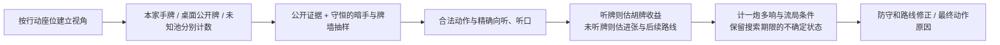

# 四川麻将 AI 算法修复记录 · 2026-09-28

基于 2.6.82（`abf8c6e`）的代码审查与针对性牌局复现。本文记录当前工作区的算法改动；[2.6.82 全景图解](algorithm-atlas-2.6.82/README.md)仍保留发布版的历史行为。

修正后的牌数合同是逐牌种 `本家手牌 + 桌面公开牌 + 未知牌 = 4`，未知牌再分配到牌墙及其他三家暗手。`Visible18` 现在只表示桌面公开牌；此前桥接把本家手牌也填入其中，使残局入口把手牌重复计数。自摸胡牌张仍在赢家暗手内；点炮胡牌张作为同一张实体牌，即使一炮多响也只计一次。普通推理与极尾盘抽样都继续给已胡退出者保留暗手占牌，避免把这些牌误算成未来能摸到的牌。相关实现位于 `scripts/ai/sichuan_tile_codec.gd`、`scripts/ai/csharp_ai_bridge.gd`、`dotnet/AI.Core/Inference/SichuanHiddenHandInferenceEngine.cs` 和 `dotnet/AI.Core/Decision/SichuanPublicEndgameEvaluator.cs`。

共享上下文缓存现在按行动座位、信息模式、策略版本和局号重新识别观察者，并串行保护其可变状态。换座位时，积分目标、手牌分析、对手危险与策略记忆会重算。修复前已复现“座位 0 为 20 分，座位 1 为 0 分，复用缓存后座位 1 错读 20 分”；同一场景的修复后检查通过。

机会模拟现在区分三种结果：真实胡牌、牌墙确实耗尽、只到达搜索期限。只有第二种结果结算流局查叫。当前座位出牌后，下一次自摸必须等前面的存活玩家摸过牌；对手摸牌也会消耗未知听口牌的期望数量。未听牌时，进张只按改善牌形计价值，不再走“摸到进张等于胡牌”的成功分支。听牌后的自摸收益根据具体听口的番型与可摸期望张数加权。点炮风险会计算可能一炮多响的逐家损失；由于公开听口概率尚未校准，这个损失只在尾盘或另有较强听牌证据时进入主分，普通前期暂用原有保守风险值。机会搜索仍是有界近似：远期对手策略、血战中对手先胡后的完整继续过程，没有在这条通用路径上穷尽模拟。

“已有副露”和“已听牌”现在是不同证据。仅碰出一副牌不再直接给出 0.86 的听牌估计，也不再被危险上下文标成“声明听牌”；定缺、弃牌、牌墙与抽样仍参与估计。前中后期改为参考剩余牌墙可提供的本家摸牌次数以及对手压力，避免同样剩八张时把四家与两家局面机械地视为同一阶段。现有听牌、持张估计仍大量使用人工权重，没有经过充分实战校准，不能把输出小数解释为测准的真实概率。

定缺保留“需要清掉多少张”的核心成本，同时计入现成刻子、对子、顺子与搭子的损失；真机所用的 AOT 入口接收完整 27 种手牌计数，原来只接收三门总张数的入口仍保留兼容。单行道继续依据三家缺同门和公开出张判断供牌，新增下一次目标花色进张后可选弃牌的危险成本、非目标花色将来需要释放的风险，以及破坏普通听牌退路的成本。该模型仍是有限牌墙近似，不能称为全局最优清一色策略。

原有多层综合评分与条件性防守裁决保留；最终若由限时搜索、极端危险、尾盘守叫或策略变体改变选牌，结果会优先带上该裁决的原因代码，避免解释被截断后只剩候选牌的基础评分。更深的多人搜索与权重校准，仍需要净得分对照支持后再扩大使用范围。

本次针对修改风险运行了可重复的座位隔离、牌数守恒、有人退出与一炮多响残局、模拟流局条件、未听牌进张、定缺牌形及阶段场景。对应测试在 `dotnet/AI.Core.Smoke/AiModelFixSmoke.cs`、`tests/current/SichuanAiTileAccountingRunner.gd`；Godot 真 C# 运行入口 29/29 项通过 `tests/current/SichuanCSharpContractRunner.gd` 验证。单行道原有场景也重新通过。配对策略对照使用固定种子运行 512 个局面；评估器原本将 26 张暗牌重复计入牌墙，现已修正样本守恒。最终候选策略平均弃牌遗憾 0.08969，内置冻结策略 0.08954；配对改进的 95% 区间为 −0.00136 至 0.00129，跨过零，未检出可确认的提升或退化。同一种子下，修正评估器后独立运行的修改前源码约为 0.08917。项目的晋级门槛通过，但这不是实战胜率证明。

极尾盘公开抽样已减到 16 个同源样本，并缩短了模拟中的弃牌求解路径。上述完整 4 张牌墙场景在本机 Release 桌面运行的尾盘模块用时约 123 毫秒；完整弃牌决策首次约 609 毫秒、热身后约 500 毫秒，仍超过界面记录的 400 毫秒目标。该预算目前只用于性能记录而非硬超时，不能宣称性能问题完全解决。真机 AOT 耗时和更广泛的复杂牌型还需设备测量。

本轮已升级到 2.6.83，重新生成 iOS arm64 NativeAOT，确认新库包含 `DecideDingQueSuitFromHand` 和 `SichuanPublicEndgameEvaluator`，并使用 Apple Development 完成 Xcode Release 真机构建。签名包位于 `build/ios/SichuanMahjong-2.6.83-ios-personal.ipa`，SHA-256 为 `df006775622ae717363c60057221d0cb97a7245fdfa7b3272fc10c5b266f746d`，压缩包完整性检查通过。三台设备（dona iPhone、iPhone、iPad）均覆盖安装并读回 2.6.83，游戏进程在启动后均可查到，稍后复查时仍在运行。上述真机证据覆盖安装和启动；真实牌局里的定缺、出牌、碰杠胡、血战继续与复杂尾盘，需要人在设备上逐项操作才能进一步验收，不能以桌面自动测试或启动进程替代，也不能据此声称真机实战胜率已提升。
