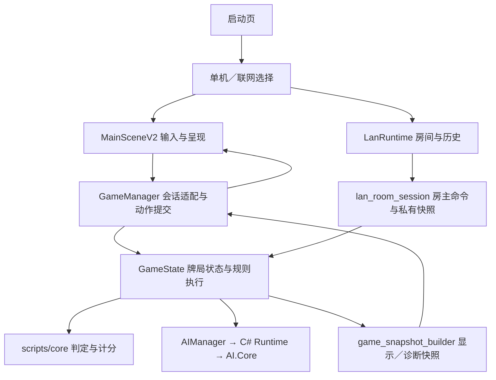

# 四川麻将当前工程架构与设计

更新时间：2026-09-27。依据为 2.6.81 备份提交 `6238d65` 之上的结构整理代码，当前交付版本为 2.6.82。本文描述现行实现；不把历史计划视为已完成能力，也不将代码中的错误自动转为规则规范。

## 启动与权威状态

`project.godot` 的启动场景为 `scenes/boot/SplashScreen.tscn`。启动后进入 `scripts/ui/network/game_mode_select.gd`，选择单机或局域网，再进入 `scenes/table/MainSceneV2.tscn`。

Godot `GameState` 保存权威玩家、牌墙、阶段、碰杠胡上下文和结算。C# 提供 AI 决策及对应分析，不接管 Godot 整局状态。单机和联机房主使用同一套权威规则路径；联机客户端提交命令、显示私有快照，不直接运行房主动作。

牌局阶段按 `GameState.RoundPhase` 为 BOOT、MAIN_MENU、TABLE_SETUP、DING_QUE、DRAW、DISCARD、REACTION、SETTLEMENT。导出包在选择模式前保持待机；编辑器／部分测试会自动初始化牌局。投骰完成后才发牌，因此 TABLE_SETUP 快照可能有四家记录而手牌仍为空。

## 当前规则与结算边界

以下取自 `scripts/core/rule_config.gd` 的默认配置：

| 项目 | 当前实现默认值 |
|---|---|
| 牌集 | 条、筒、万，27 类、108 张 |
| 定缺与胡牌限制 | 开局定缺，需缺一门才能胡；缺门优先出牌由状态执行层约束 |
| 吃／碰／杠 | 不允许吃；允许碰、杠与抢杠胡 |
| 下局庄家 | 首胡者坐庄；只有首批胡牌属于同一张出牌的双响/三响才由点炮者坐庄；无人胡牌留庄 |
| 血战与多响 | 血战到底，最多三家胡牌，允许一炮多响 |
| 基础分与封顶 | 底分 1，4 番封顶 |
| 自摸 | 权威计分层增加 1 底，UI 不再次加分 |
| 流局 | 查叫、花猪开启；`enable_tui_shui=false`，流局不默认退税 |
| 杠后 | 呼叫转移开启；点杠花按点炮处理 |

胡牌判定、番数、反应优先级、流局与积分分别由 `scripts/core` 的判定模块供 `GameState` 调用。`settlement_data.score_changes` 是结算展示的权威总账。

`presentation/settlement_ledger.gd` 只将胡牌、杠分、退税事件、呼叫转移和查叫等事件转为明细。保留处理退税事件的展示代码不代表默认规则开启退税。明细合计不等于权威总账时显示校验失败，不用补差分数掩盖错误。座位名称通过 Callable 输入，模块不引用 UI 控件、不修改玩家积分。

## 快照与性能职责

`GameState.get_gameplay_snapshot(viewer_seat)` 调用 `scripts/game/game_snapshot_builder.gd`，生成独立可修改的显示数据：玩家、合法动作、阶段、规则、结算、开局信息、AI 提示及工具栏所需配置。它不生成 AI 完整诊断、待决策 payload、反应复盘历史或完整训练记录。

`GameState.get_debug_snapshot(viewer_seat)` 保留原有完整诊断字段，由同一模块在基础快照上补充诊断数据。普通 `state_changed` 信号传显示快照；`GameManager` 在本地座位为零时复用已生成的数据并复制隔离，其他座位按各自视角构建和映射。

`GameManager.get_snapshot()` 返回显示快照副本；`get_fresh_snapshot()` 重新取得显示数据；`get_diagnostic_snapshot()` 显式读取完整诊断，客户端仍只能获得自己的私有显示快照。AI 调参面板隐藏时不更新诊断文字，打开后主动读取完整诊断，显示过程中继续刷新。

没有缓存合法动作或引入超时替代 AI。快照只用于呈现，动作仍按当前权威状态校验。3D 牌的 `SichuanTile3D.configure` 已有配置签名缓存，本次没有再叠加一个可能漏掉动态标记的缓存。

`diagnostics/pipeline_profiler.gd` 默认关闭，可通过 `SICHUAN_PROFILE_PIPELINE=1` 或游戏参数 `--profile-pipeline` 开启。记录输入分发、动作提交、快照生成、UI 刷新、3D 更新和同步 native AI 返回；每类最多保留最近 256 条。离开牌桌时写 `user://pipeline_profile.json`。

计时单位为微秒，分段包含嵌套调用，不能相加作为整条链路总耗时。它测量 CPU 调用耗时，不包含 GPU 绘制、屏幕实际显示延迟或异步 AI 全部等待时间。安卓整体响应结论需要在问题设备上重新采样。

## UI、声音与偏好

`MainSceneV2.gd` 仍负责输入、动画、布局、各面板生命周期与状态编排；`SichuanTableStage3D.gd` 负责桌、牌的位置、材质与动效；`scripts/ui/table` 是实际工具栏、操作栏、选声音、换桌布等控件。保留现有可用的 2D 显示路径，不将“非默认”视为“无用”。

新增职责模块：

| 模块 | 职责 |
|---|---|
| `scripts/game/presentation/table_voice_router.gd` | 座位音色、匹配语言及性别的随机选音色、个人选择优先、语音路径和流缓存 |
| `scripts/game/presentation/table_preferences.gd` | 读取／保存偏好，校验音色与皮肤，迁移旧透明度档位和抽屉位置版本 |
| `scripts/game/presentation/settlement_ledger.gd` | 结算事件明细与账本合计检查 |
| `scripts/diagnostics/diagnostic_files.gd` | 有界诊断压缩、诊断文本收集和导出文件操作 |

结算名字旁按本地视角显示本家、上家、对家、下家；关闭和下一局共用原有蓝色玻璃纹理及交互状态。

语音选项来源为 `res/audio/voice_manifest.json`，当前共 14 种，面板可筛选普通话／四川话并试听。工具栏的语言切换影响自动选择的座位音色；本家明确选择的音色优先，语言切换不覆盖它。存储仍使用 `user://ui_prefs.cfg` 的 `main_scene_v2` 段，原有键保持兼容。

## C# AI 和历史桥接

正式调用链为 `GameState → AIManager → SichuanCSharpRuntime.cs → dotnet/AI.Core`，处理定缺、出牌、碰杠胡过和自摸／杠。Godot 提供当前状态与合法候选，C# 返回决策，Godot 验证并执行。

公平 AI 使用本家已知及场上公开信息；透视地狱挑战是显式独立模式。`strict_native_runtime_required=true`，本次整理没有修改 AI 算法或加入前端兜底动作。

`AICoreBridge.gd` 仍参与 payload 构建与牌编码，不能删除。`csharp_ai_bridge.gd` 的 CLI／本机 TCP 主机路径仍用于桌面诊断和相关测试；移动端依赖 Native runtime，不把桌面 CLI 测试当作 iPhone 验证。

`Strategy/SichuanSingleLaneEvaluator.cs` 处理其他三家都定缺同一门、本家保有该门的公开信息路线。它按公开弃牌判断哪些对手已清缺，估计牌墙/待清缺供张；已公开证明全部清缺时，该门未见牌只能在牌墙。逐个目标摸张后枚举合法弃牌，计入普通胡退路、未来弃牌风险、有限牌墙预算和清色封顶增益。评分替代旧的固定“打异门加分/打目标门扣分”，保留原有防守与临近流局约束。完成概率是有限路线模型的估计，不是校准后的整局胜率，也不保证数学上的全局最优。缓存限定于一次请求，避免后台并发互相干扰。

## 局域网协议和隐私

`LanRuntime` 编排发现、房间、进入牌桌及历史；`lan_room_session` 承载会话；`match_authority` 按注册玩家身份、座位和动作序列验证命令。房主执行状态机，再为每个接收座位生成合法动作与私有快照。

`snapshot_projector.gd` 保持 schema_version 1、local_seat_id 0。将权威座位映射到本地视角；牌局未结算时删除其他玩家手牌，保留手牌张数；结算时允许展示整局结果。诊断字段不进入网络投影。

`protocol_codec.gd` 保持 protocol_version 1、最大消息 65,536 字节，并检查字典、字符串、数组与嵌套深度。客户端的命令 pending／失败回滚和历史同步路径保持原接口，本次只改变投影前的快照来源。

## 美术生成与交付

现用牌桌的批准源文件为 `source_assets/table/launch_glass_v1/launch_glass_table_review.blend`。正式入口是 `tools/3d/generate_current_table.py`，从该源文件导出到明确指定的审核路径，检查六个桌体节点与内嵌图片，禁止直接覆盖现用 GLB。

`preview_launch_table_frame.py` 只写实验目录；`generate_sichuan_table_v2.py` 是旧基础桌生成器，必须指定审核输出，贴图也写入审核目录，禁止覆盖现用桌子。Godot 决定最终换肤、灯光与运行时玻璃材质；不能将基础 Blender 材质当作完整游戏呈现。

其他 UI 仍沿用 Blender 源／生成脚本 → PNG／GLB → Godot 控件的流程。语音来自此前豆包语音合成及本地切片成果，工程内保留命名清单和可播放素材，不依赖浏览器在线播放。

Android 和 iOS 的正式脚本分别为 `tools/export_android_release.sh`、`tools/export_ios_xcode_project.sh`，构建根目录现从脚本所在位置解析。机器相关 SDK、模板、签名材料仍按脚本的本机配置／环境覆盖项提供，不宣称任意新电脑无需配置即可打包。

Android 的已验证 Mono 原生库恢复流程仍依赖历史 1.0.42 APK 或其提取库，这是有效构建依赖，本次保留。iOS 需 Godot .NET 模板、NativeAOT framework、Xcode Apple Development 签名和个人开发者配置。安装、启动、关键玩法必须分层验证；结构整理阶段没有重新打包；其后的 2.6.82 修复交付另按构建、签名、安装和启动分层记录。

## 清理与文档维护

旧 `MainTable.gd`／`MainTable.tscn` 已移到 `archive/legacy_table`，UID 和原文保留，`.gdignore` 排除运行扫描。可再生成的 Swift／Python 缓存和 Xcode 中间目录已清理，签名、已签名应用、安装包、现用导入及 runtime 输出保留。

已移除四张无现行引用的旧 importer 贴图副本，保留 `materials/table_v2` 原图。源图与运行启动图、平台图标槽位以及不同皮肤中的相同图像有各自用途，不统一删除。`tools/audit_project_dependencies.py` 提供只读引用与重复内容盘点；动态路径、反射、生成素材和原生依赖仍需沿代码核查。

旧内江“当前”设计导航、handoff 和 backlog 原文保存在 `archive/historical_docs`；现行文档入口按四川工程重写，历史设计与证据不改写为新结论。

结构整理完成并验证后按实际代码更新现行文档。发现规则实现与已经确定的规则不一致时先说明和纠正，不让错误实现成为新规范。每次只按修改风险选择聚焦验证，不建立默认执行的固定回归清单。
